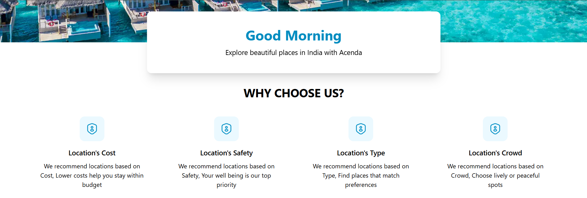
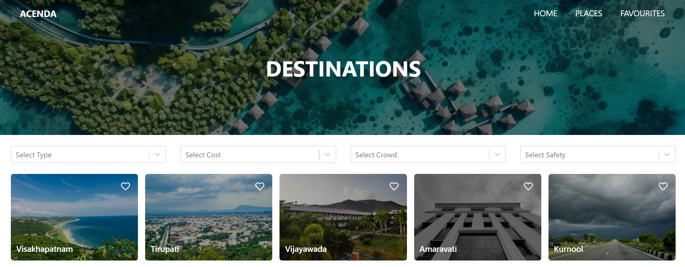
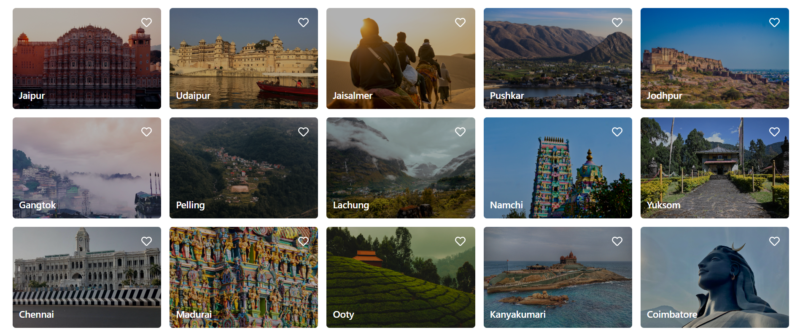
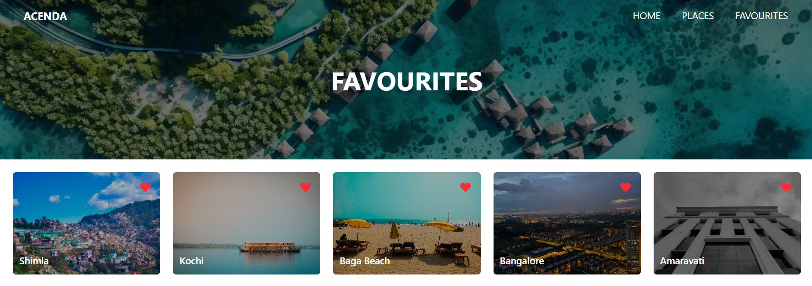
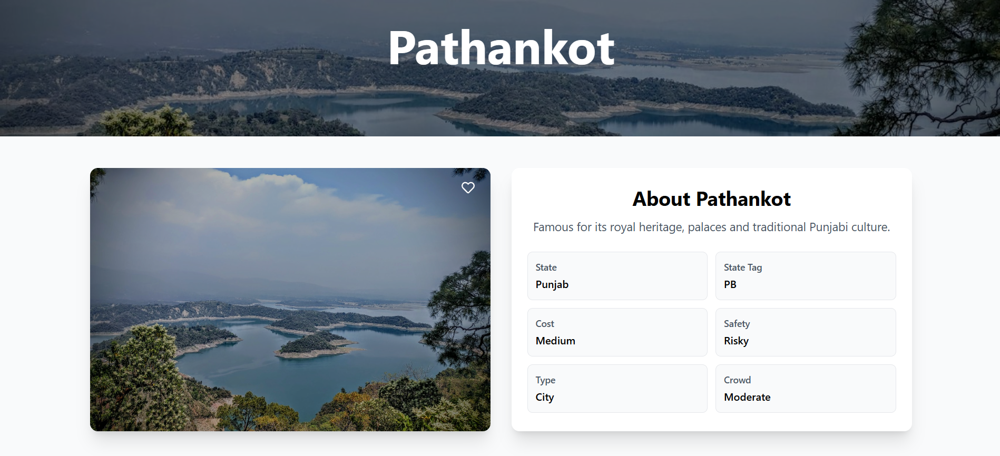
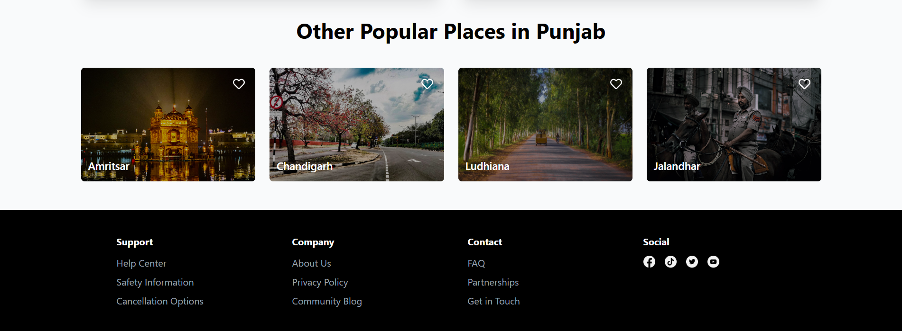

# ACENDA - Travel and Explore

A modern travel website that helps users discover and explore beautiful places across India. Acenda provides detailed information about various destinations, including their type, cost, safety and crowd levels


## Features
  

-  **Interactive Place Directory**: Browse through a comprehensive list of places across India

-  **Smart Filtering**: Filter places based on:

  Type (City, Mountains, Beaches)

  Cost (Low to Medium, Medium to High)

  Crowd (Quiet, Moderate, Crowded)

  Safety (Safe to Moderate, Moderate to Risky)

-  **Favorites System**: Save your favorite places for quick access

-  **Detailed Place Information**: View comprehensive details about each destination

-  **Responsive Design**: Fully responsive layout that works on all devices

-  **Modern UI**: Clean user interface with smooth animations

  
## Tech Stack

  
-  **Frontend**: Next.js, React

-  **Styling**: Tailwind CSS

-  **State Management**: Redux Toolkit

-  **Icons**: Lucide React, React Icons

-  **Notifications**: React Hot Toast

-  **Drop Down**: React Select

 -  **Lazy loading**: React Intersection Observer

  
## Project Structure

```
├── public      # Static assets

├── redux       # Redux store and slices

src/

├── components  # Reusable UI components

├── styles      # Global styles

├── pages       # Next.js pages

└── api         # Local API
```  

## Visual Overview

### Home Page



### Destinations Page




### Favourites Page


### Detailed Place Info Page




## Contributing

Contributions are welcome! Please feel free to submit a Pull Request

## Acknowledgments

- Icons from Lucide React and React Icons

- Images provided by Unsplash are stored in Cloudinary
